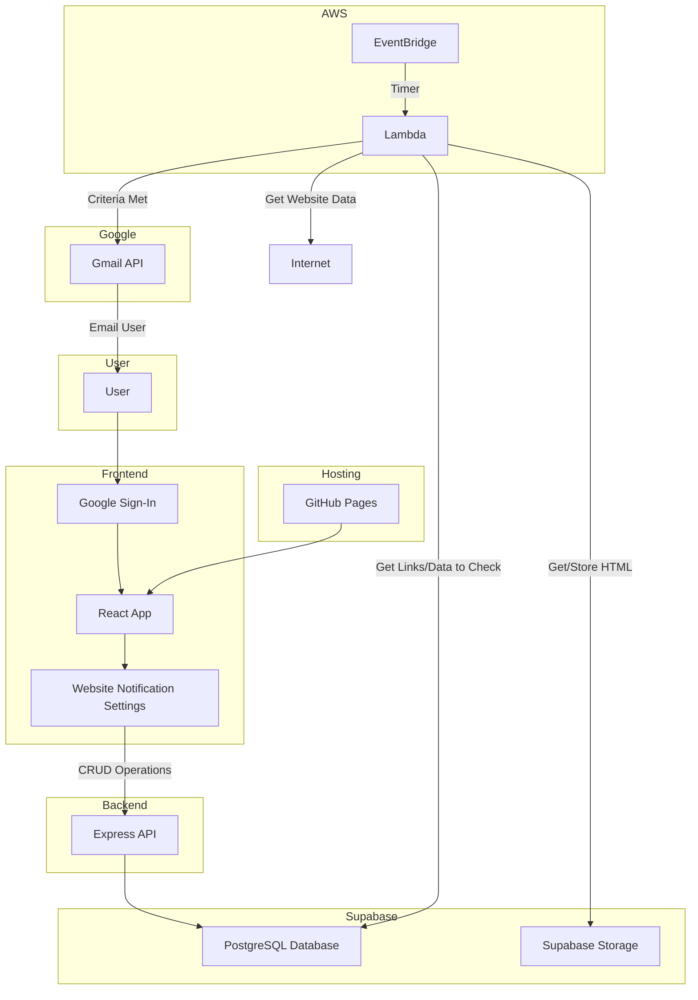
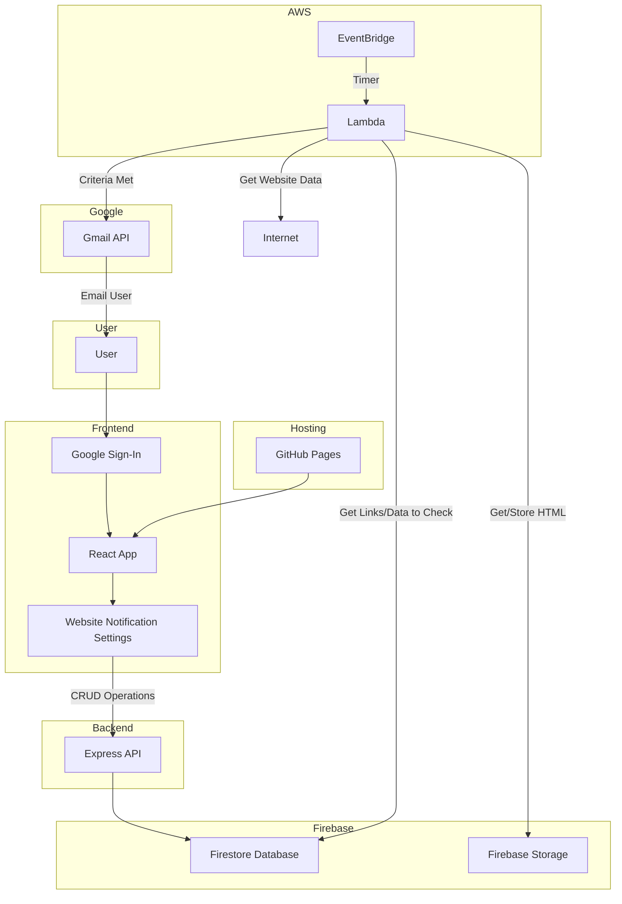
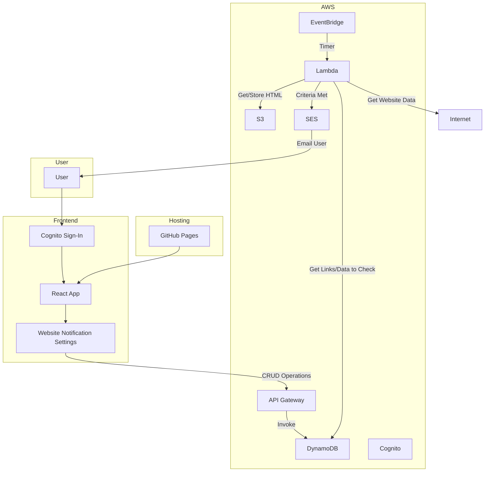
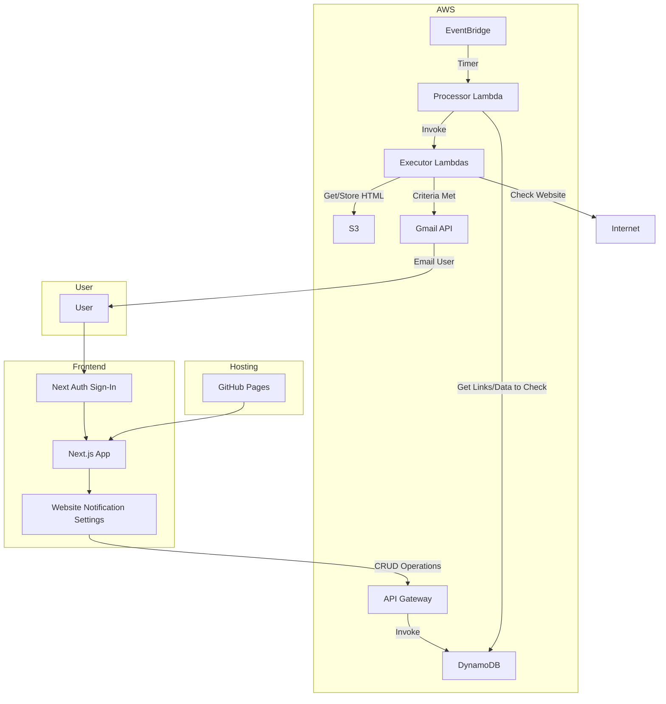

# Store Checker Lambda

This lambda has two functionalities: 
1. Check an item's URL and see if it is available to buy
2. Get the lowest priced item from an Ebay search and check against threshold

Both are implemented together, with Enum to differentiate and unique fields in `links.py`

Emails are sent for results, using environment variables for `sender`, `receiver`, `password`

## Adding Modules to Lambda Layer

Create `python` folder (or any name), install modules to it, then add onto layer in AWS console.

- `mkdir python`
- `pip install -t python requests beautifulsoup4 aiohttp lxml tenacity`
- Zip it
- Upload to AWS layer











## Project Structure

```
project-root/
├── core/
│   └── ...                 # Core logic of the service
├── api/
│   └── ...                 # API endpoints and handlers
├── ui/
│   └── ...                 # User interface components and logic
└── deploy/
    ├── deploy-core.mjs     # Deployment script for the core service
    └── deploy-api.mjs      # Deployment script for the API service
```

## Deployment

To deploy the application, follow these steps. Make sure you have the necessary environment variables and dependencies set up.

### Prerequisites

- [Node.js](https://nodejs.org/) installed
- [Serverless Framework](https://www.serverless.com/framework/docs/getting-started/) installed
- AWS credentials configured for Serverless

### Setup

1. **Install dependencies:**

`npm install`

2. **Ensure AWS credentials are configured:**

Set up AWS credentials using the AWS CLI or manually configuring the ~/.aws/credentials file.

3. **Deploying Core**

Dev: `npm run deploy:core:dev`

Prod: `npm run deploy:core:prod`

3. **Deploying API**

Dev: `npm run deploy:api:dev`

Prod: `npm run deploy:api:prod`

4. **Deploying UI**

Changes to main branch auto-deployed by Vercel.