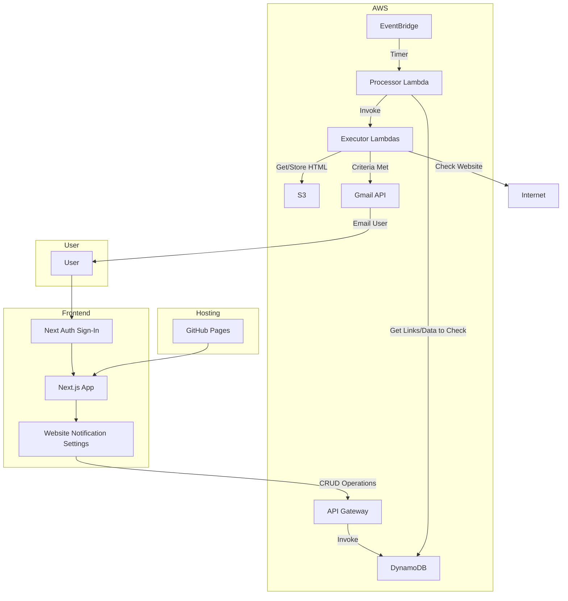

# Store Checker Lambda

The Store Checker Lambda is a versatile and extensible solution for automating the monitoring of websites using a variety of functions. It allows for customizable checks based on user-defined criteria and intervals, ensuring timely notifications when specified conditions are met.

## Features

- **Automated Monitoring**: Continuously monitors specified URLs at user-defined intervals.
- **Customizable Functions**: Supports various functions for different types of checks, such as keyword presence and price thresholds.
- **Email Notifications**: Sends alerts when specified criteria are met, using configurable email settings.
- **Extensible Architecture**: Easily add new check functions as needed. Current functionalities include keyword presence and price threshold checks.
- **Configuration**: Customize URLs, keywords, and price thresholds via a straightforward setup process.
- **Authentication and Permissions**: Features authentication with different permissions per account, controlling the number of URL checks allowed and the frequency of checks.

## How It Works

1. **User Configuration**: Specify the URLs to monitor, the type of check (e.g., keyword or price threshold), and the checking interval via UI.
2. **Automated Checks**: The Lambda function executes the specified checks at the defined intervals.
3. **Notification**: Sends an email notification when the criteria for any check are met.

## Current Functionalities

URL is given by user, pointing to exact URL to check. For example, on Ebay Price Threshold Check, the URL will point to the user's desired search query. On the backend, we add (if needed) paramaters to the URL to query and sort for lowest priced "buy-it-now" items, which ensures the lowest priced item will be on the given URL. Each function may work slightly differently in terms of preprocessing.

1. **Keyword Check**: Monitors a specified URL for the presence (or lack thereof) of user-defined keywords, triggering notifications when keywords are detected.
   - Parameters: `url: string`, `keyword: string`, `opposite: boolean`
2. **Ebay Price Threshold Check**: Searches for the lowest priced item on Ebay and alerts the user when the price falls below a predefined threshold.
   - Parameters: `url: string`, `threshold: number`

## Project Structure

```
project-root/
├── core/
│   └── ...                 # Core logic of the service
├── api/
│   └── ...                 # API endpoints and handlers
├── ui/
│   └── ...                 # User interface components and logic
└── deploy/
    ├── deploy-core.mjs     # Deployment script for the core service
    └── deploy-api.mjs      # Deployment script for the API service
```



## Deployment

To deploy the application, follow these steps. Make sure you have the necessary environment variables and dependencies set up.

### Prerequisites

- [Node.js](https://nodejs.org/) installed
- [Serverless Framework](https://www.serverless.com/framework/docs/getting-started/) installed
- AWS credentials configured for Serverless

### Setup

1. **Install dependencies:**
    - `npm install`

2. **Ensure AWS credentials are configured:**
    - Set up AWS credentials using the AWS CLI or manually configuring the ~/.aws/credentials file.

3. **Deploying Core**
    - Dev: `npm run deploy:core:dev`
    - Prod: `npm run deploy:core:prod`

3. **Deploying API**
    - Dev: `npm run deploy:api:dev`
    - Prod: `npm run deploy:api:prod`

4. **Deploying UI**
    - Changes to main branch auto-deployed by Vercel.