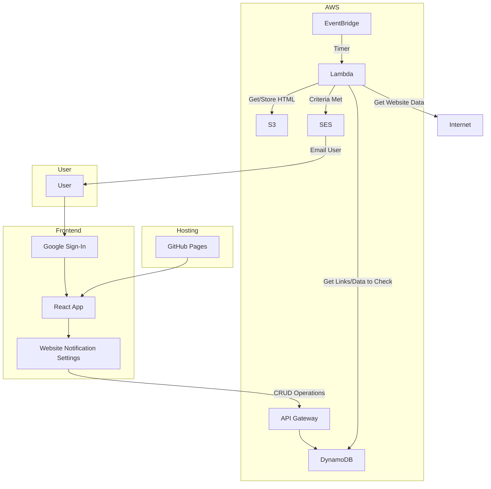

# Store Checker Lambda

This lambda has two functionalities: 
1. Check an item's URL and see if it is available to buy
2. Get the lowest priced item from an Ebay search and check against threshold

Both are implemented together, with Enum to differentiate and unique fields in `links.py`

Emails are sent for results, using environment variables for `sender`, `receiver`, `password`

## Adding Modules to Lambda Layer

Create `python` folder (or any name), install modules to it, then add onto layer in AWS console.

- `mkdir python`
- `pip install -t python requests beautifulsoup4 aiohttp lxml tenacity`
- Zip it
- Upload to AWS layer

