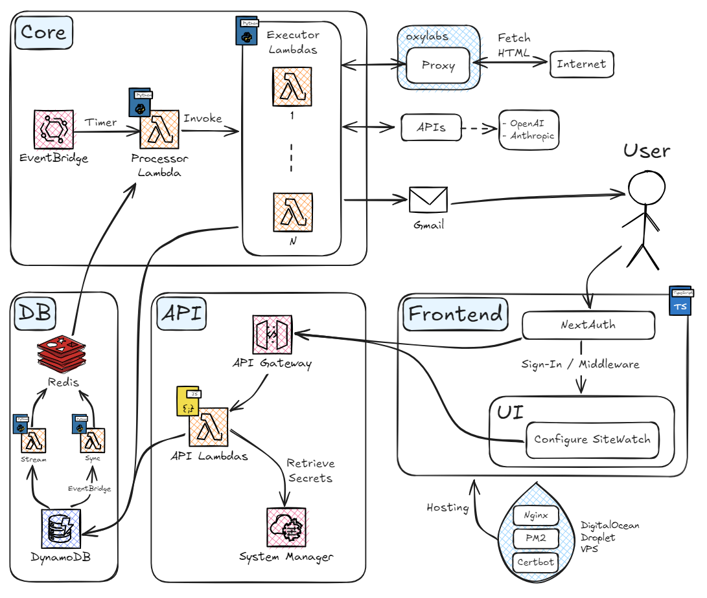

# SiteWatch

SiteWatch is an extensible solution for automating the website monitoring and alerting using a variety of functions. It allows for customizable checks based on user-defined criteria and intervals, sending out email notifications when conditions are met.

## Features

- **Automated Monitoring**: Continuously monitors specified URLs at user-defined intervals.
- **Customizable Functions**: Supports various functions for different types of checks, such as keyword presence and price thresholds.
- **Email Notifications**: Sends alerts when specified criteria are met, using configurable email settings.
- **Extensible Architecture**: Easily add new check functions as needed. Current functionalities include keyword presence and price threshold checks.
- **Configuration**: Customize URLs, keywords, and price thresholds via a straightforward setup process.
- **Authentication and Permissions**: Features authentication with different permissions per account, controlling the number of URL checks allowed and the frequency of checks.

## How It Works

1. **User Configuration**: Specify the URLs to monitor, the type of check (e.g., keyword or price threshold), and the checking interval via UI.
2. **Automated Checks**: The Lambda function executes the specified checks at the defined intervals.
3. **Notification**: Sends an email notification when the criteria for any check are met.

## Current Check Functions

1. **KEYWORD_CHECK**: Monitors a specified URL for the presence (or lack thereof) of user-defined keywords, triggering notifications when keywords are detected.
   - Parameters: `url: string`, `keyword: string`, `opposite: boolean`
2. **EBAY_PRICE_THRESHOLD**: Searches for the lowest priced item on Ebay and alerts the user when the price falls below a predefined threshold.
   - Parameters: `url: string`, `threshold: number`
3. **AI_CHECK**: Lets a user define a LLM prompt with a notification condition, gets alerted if LLM determines condition met.
   - Parameters: `prompt: string`, `notify_condition: string`
4. **PAGE_DIFFERENCE**: Each run, stores the current HTML from given URL. If the current run find X% difference, alerts user. Percent defined by user.
   - Parameters: `percent_diff: number | "ANY"`

### URL Preprocessing

Some URL Parameter preprocessing is done after it is submitted by a user, and is typically just a validity check. Some functions have unique processing:

1. **EBAY_PRICE_THRESHOLD**: 
   - Verifies URL is valid Ebay link
   - Verifies search parameter in URL, if not then request from User
   - Adds URL parameters (if does not exist) to query and sort by "buy it now" and "lowest price first"

## Project Structure

```
project-root/
├── core/
│   └── ...                 # Core logic of the service
├── api/
│   └── ...                 # API endpoints and handlers
├── ui/
│   └── ...                 # User interface components and logic
└── deploy/
    ├── deploy-core.mjs
    └── deploy-api.mjs
```

1. Core
   1. Processor Lambda
      1. Fetches all URLs stored in DynamoDB ready to run
      2. Batches URLs, spins up Executor Lambda for each batch
   2. Executor Lambda
      1. Performs functionality cheks on given URLs
      2. Sends emails through GMail API when necessary
2. API
   1. CRUD Lambdas for interacting with DynamoDB
3. UI
   1. Frontend, authentication, user interaction
4. Deploy
   1. Serverless Framework deploys for Core and API, see [Deployment](#deployment)

## Architecture

### Frontend
- TypeScript
- Next.js
- React
- Vercel Hosting
- NextAuth.js
  - OAuth-based authentication for Next.js
- Axios
  - Promise-based HTTP client
- Tailwind
- shadcn/ui
- Aceternity UI
  - Fancy hero section

### Backend
- Lambdas
  - Core Processor/Executor Lambda (Python 3.8)
  - API CRUD Lambdas (Node.js 20.x)
- Amazon EventBridge
  - Run core processor lambda on timer
- AWS API Gateway
  - Manages APIs, integrates with Lambda, provides security
- DynamoDB
  - Single-table design
- Gmail API
- Serverless Framework
  - AWS Deployments
  - Deploys Processor/Executor Lambdas, API Gateway, API Lambdas, DynamoDB
  - Dev and Prod environments
- AWS SSM Parameter Store
  - Store secrets and parameters



## Core Functionality

As mentioned above, core functionality is implemented via a `Processor Lambda` and an `Executor Lambda`. The processor is responsible for fetching URLs from DynamoDB, and spinning up executor lambdas each with a batch of URLs to process.

Table here

User interacts via a main table on the front end, where they can see their list of URLs currently being monitored, along with some helpful information. Here they can also create a new URL monitor, selecting a Check Type and entering the required paramaters for that Check Type. Supports editing any field.

Implements some nice-to-haves, like:

- If you choose to run every 24 hours you can select which hour to run at each day. Similar can be done for every check >1 hour.
- Table field indicating when next run will happen, and the result status and time of the previous run
- When you were most recently alerted by the specific URL monitor
- A flyout page with more information
- Sorting by different Check Types will show that type's parameters in the table
- Many table fields can be hovered over for more information

### Implementation Details

- Built in Python
- Built with `aiohttp` and `asyncio` to fetch HTML from URLs asynchronously to improve performance. Note there is a concurrency limit of 1000 on AWS Lambda. 
  - See `/core/lambda_executor.py`
- Implements random `header` and `proxy` selection when making requests.
  - See `/core/fetch_url.py`
- Easily extensible with new functions, just plug-and-play.
  - See `/core/url_check_functions/`
- Test suite for verifying all end to end core functionality
  - See `/core/lambda_test.py`
- Generates test data with 100k+ real URLs taken from [Common Crawl](https://data.commoncrawl.org/crawl-data/CC-MAIN-2024-26/index.html) dataset

### Todo

- Unique tests for each unique check function would be nice
- pino logging

## API Functionality

The API layer is responsible for interacting with DynamoDB, managing user configurations, and providing endpoints for the frontend to communicate with the backend. It includes CRUD operations for managing URLs and user settings.

### Key Features

1. **CRUD Operations**: Create, Read, Update, Delete operations for managing user configurations.
2. **Secure Configuration Management**: Uses AWS SSM Parameter Store for securely managing and retrieving configuration parameters and secrets.

### How It Works

1. **Endpoint Handling**: API Gateway routes requests to appropriate Lambda functions.
2. **SSM Parameter Retrieval**: Lambda functions retrieve sensitive data like database connection strings and API keys from AWS SSM Parameter Store.
3. **Database Interactions**: Lambda functions perform CRUD operations on DynamoDB using parameters retrieved from SSM.

 
## Authentication & Permissioning

Uses NextAuth.js, currently allowing sign-in via Google. Implements `middleware` to verify page level access.

Permissions tied to each account. Allows for different limits or tier per account. For example, the current free tier allows for a maximum of 5 URLs being watched, with a minimum delay between runs at 4 hours.

## Deployment

To deploy the application, follow these steps. Make sure you have the necessary environment variables and dependencies set up.

### Prerequisites

- [Node.js](https://nodejs.org/) installed
- [Serverless Framework](https://www.serverless.com/framework/docs/getting-started/) installed
- AWS credentials configured for Serverless

### Setup

1. **Install dependencies:**
    - `npm install`

2. **Ensure AWS credentials are configured:**
    - Set up AWS credentials using the AWS CLI or manually configuring the ~/.aws/credentials file.

3. **Deploying Core**
    - Dev: `npm run deploy:core:dev`
    - Prod: `npm run deploy:core:prod`

3. **Deploying API**
    - Dev: `npm run deploy:api:dev`
    - Prod: `npm run deploy:api:prod`

4. **Deploying UI**
    - Changes to main branch auto-deployed by Vercel.

## Adding New Check Function

To add a new custom function:

1. Update ui/constants.ts
2. Update lib/types.ts
3. TODO

## Debugging Notes

### NextAuth

See logs in terminal